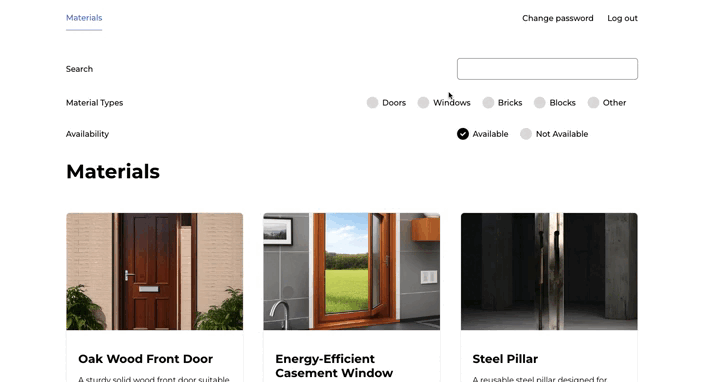

# Take Home Exercise

## Table of Contents
- [Key Technologies Used](#key-technologies-used)
- [Deployment Guide](#deployment-guide)
- [Demo](#demo)
  - [User Creation Demo](#user-creation-demo)
  - [Materials Page Demo](#materials-page-demo)
- [Must-Have Features](#must-have-features)
  - [Frontend Material List and Intuitive Interface](#frontend-material-list-and-intuitive-interface) 
  - [Communication Between Frontend and Backend](#communication-between-frontend-and-backend)
  - [README File](#readme-file)
- [Nice-To-Have Features](#nice-to-have-features)
  - [Filter and Search Functionality](#filter-and-search-functionality)
  - [Real-Time Material Updates via WebSocket Integration](#real-time-material-updates-via-websocket-integration)
  - [User Authentication](#user-authentication)
- [Other Features](#other-features)
  - [Custom Image Loading and Storage](#material-data-import-command)
  - [Interactive 3D Background](#interactive-3d-background)
- [Contact Me](#contact-me)

## Key Technologies Used

- **React**
- **Django**
- **WebSocket**
- **Docker**
- **Nginx**
- **Redis**

## Deployment Guide

### Prerequisites

Ensure you have **Docker** and **Docker Compose** installed on your machine. If not, follow the official guides to install:
- [Docker](https://docs.docker.com/get-docker/)
- [Docker Compose](https://docs.docker.com/compose/install/)

### Deployment Steps

1. **Get to the Project Folder**:

   First, open your terminal or command prompt.

   Now, type the below line. Replace `<path to your project>` with the actual location of your project:
   ```bash
   cd <path to your project>/Aleksandra_Redichkina_TakeHomeExercise/infra/

2. **Run the Deployment Script**: 

  - **For Mac or Linux**:

     ```bash
     chmod +x ./docker_commands.sh && ./docker_commands.sh
     ```

     If you encounter permissions issues, you can also try running the script using the following commands:
     
     ```bash
     xattr -d com.apple.quarantine ./docker_commands.sh

     sudo chmod +x ./docker_commands.sh

     ./docker_commands.sh
     ```

     If you experience any issues executing `docker_commands.sh`, you can try entering the commands manually:

     ```bash
     docker-compose up --build -d --remove-orphans

     sudo docker-compose exec backend python manage.py migrate --noinput

     sudo docker-compose exec backend python manage.py collectstatic --noinput

     sudo docker-compose exec backend python manage.py createsuperuser
     ```

     Then provide the required details:

     ```
     username
     email
     password
     ```

  - **For Windows**: 

     ```bash
     docker_commands.bat
     ```

     If you experience any issues executing `docker_commands.bat`, you can try entering the commands manually:

     ```bash
     docker-compose up --build -d --remove-orphans

     docker-compose exec backend python manage.py migrate --noinput

     docker-compose exec backend python manage.py collectstatic --noinput

     docker-compose exec backend python manage.py createsuperuser
     ```

     Then provide the required details:

     ```
     username
     email
     password
     ```

2. **Access the Application**: 

    - `http://localhost/`
    - `http://localhost/admin/`


3. **Superuser Access**: 

    The script has created a default superuser for you. Use the following credentials to access admin functionalities:

    - **Username**: admin
    - **Email**: admin@example.com
    - **Password**: adminpassword

    *Remember to change these default credentials or create a new superuser for security reasons.*

## Demo

### User Creation Demo


### Materials Page Demo



1. ### Frontend Material List and Intuitive Interface
    The web page http://localhost/materials/ displays a list of materials fetched from the backend API. Remember that you need to authorize first.
    
    The page presents materials in a card format. Each material entry includes its name, description, and a quantifiable amount. Pagination controls allow users to navigate through the list efficiently
    
    Cards and page design assist users in finding the material they are looking for. In the future, you can add the option to select materials for a project's cart.
    
    A modern design approach is adopted to provide an aesthetically pleasing and user-friendly interface. The color palette, typography, and layout contribute to a visually coherent experience. Incorporating a 3D visual element, the background of the start page is powered by the Vanta.js library.

2. ### Communication Between Frontend and Backend
    The backend and frontend are closely integrated to deliver a seamless user experience. The backend exposes APIs for data interactions and WebSocket endpoints for real-time updates.
    
    The frontend communicates with the backend using RESTful API requests. It can retrieve, create, update, and delete data through these endpoints. The **API documentation** is available at **./Aleksandra_Redichkina_TakeHomeExercise/docs/openapi-schema.yml.**
    
    Real-time updates are facilitated through WebSocket connections. The backend sends notifications and data updates to the frontend, enabling users to stay informed without requiring manual refreshes.
    
    The application's deployment is containerized using Docker and orchestrated with docker-compose.yml.
    
    ### Services

    - **db**: PostgreSQL database for data storage, with persistent volumes for data preservation.
    - **backend**: Backend application built from Dockerfile, connected to the database and serving static/media files.
    - **frontend**: Frontend application's build mounted for serving.
    - **nginx**: Nginx web server serving frontend and API docs, with configuration and mounted volumes.
    - **redis**: Redis container for real-time communication, ensuring WebSocket functionality.

3. ### Filter and Search Functionality
    The materials page offers both filtering and search capabilities:
    
    Users can pick checkboxes corresponding to the material type (e.g., doors, windows, bricks, etc.) they are interested in, refining the displayed results to better match their preferences.
    
    The search functionality allows users to search for materials by name, quickly finding the specific items they're looking for.

      📌 **Kind Reminder:** When loading data into the database, the default file type is set to "other". You can modify this setting in the admin panel.
  

4. ### Real-Time Material Updates via WebSocket Integration
    The materials page features real-time material updates. By leveraging WebSocket technology and the Channels library, this update delivers immediate notifications without the need for manual intervention or page refreshes.
    
    Testing the Feature
    
    - Log in as a superuser to the admin area
    - Navigate to the materials page.
    - Update material information (any information) or add new materials.
    - Observe how all changes are instantly reflected in real-time. 😊

5. ### User Authentication
      The application is set up with user authentication. Only registered and logged-in users have access to the materials page.

6. ### Material Data Import Command
    For populating the database with material data, a specialized management command, ***load_materials***, has been introduced. This command reads a specified JSON file, extracts material data, and integrates this data into the database.

    One of the command's features is image optimization using Pillow. During the image processing phase, the dimensions of images are checked. ***If an image's size exceeds a predefined maximum, it is resized to ensure optimal storage and loading performance***.

    The application has a custom storage mechanism through ***the CustomThumborStorage class***. Unlike the default ThumborStorage, this custom ***storage doesn't validate file names before saving***. This offers flexibility in the file saving process.

7. ### Interactive 3D Background
    The application incorporates an interactive 3D globe background. This visual element, using the vanta.globe effect, responds to mouse movements. The background's visual properties are customizable.

